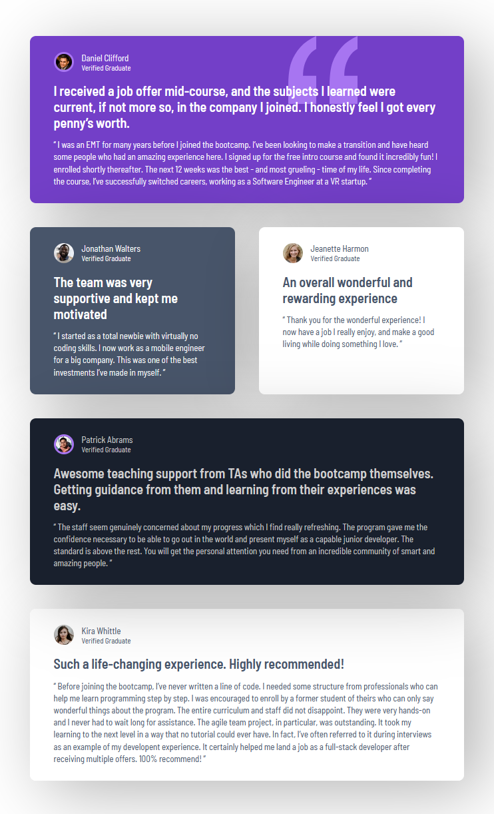

# Frontend Mentor - Testimonials grid section solution

This is a solution to the [Testimonials grid section challenge on Frontend Mentor](https://www.frontendmentor.io/challenges/testimonials-grid-section-Nnw6J7Un7).

## Table of contents

- [Overview](#overview)
  - [The challenge](#the-challenge)
  - [Screenshot](#screenshot)
  - [Links](#links)
- [My process](#my-process)
  - [Built with](#built-with)
  - [Useful resources](#useful-resources)
- [Author](#author)

## Overview

### The challenge

Users should be able to:

- View the optimal layout for the site depending on their device's screen size

### Screenshot

Desktop:

Tablet:

Mobile:

### Links

- [Solution URL](https://github.com/bsd-rgb/Testimonial-Grid-Section)
- [Live Site URL](https://your-live-site-url.com)

## My process

### Built with

- HTML
- CSS
  - Grid

### Useful resources

- [Understanding CSS Position Property](https://www.peterlunch.com/blog/understanding-the-css-position-property) - This blog post is something I visit often! It really breaks down the CSS position property. I recommend it to anyone who is still learning this concept or needs a refresher.

## Author

- Frontend Mentor - [@bsd-rgb](https://www.frontendmentor.io/profile/bsd-rgb)
